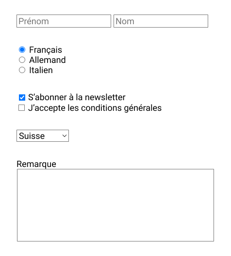
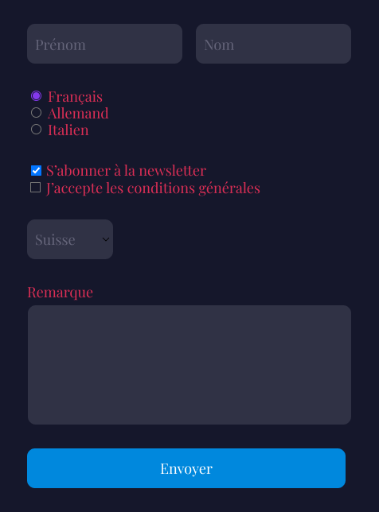
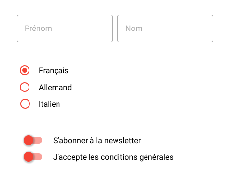

# Exercice Formulaires 1

Intégrez les 3 formulaires depuis figma.

Pour la maquette _Formulaire 3_, vous aurez besoin du tutoriel ["Quelques astuces pour les éléments de formulaire"](https://www.notion.so/eikon-imd/Quelques-astuces-pour-les-l-ments-de-formulaire-3465870859ac46cc96f0ab9b1a68f738?pvs=4).

### Trouver les maquettes

Les fichiers se trouvent:

- dans l'équipe de votre classe
- dans le projet _FD-05-Formulaires_

### Démarrer un projet

Pour chaque formulaire:

- Clonez le repository
- Ouvrez le avec Visual Studio Code
- Ouvrez le terminal et entrez la commande _starterkit-create_
- Choisissez l'option _dans le dossier actuel_
- Lancez le serveur avec la commande _npm run dev_

### Aperçus

